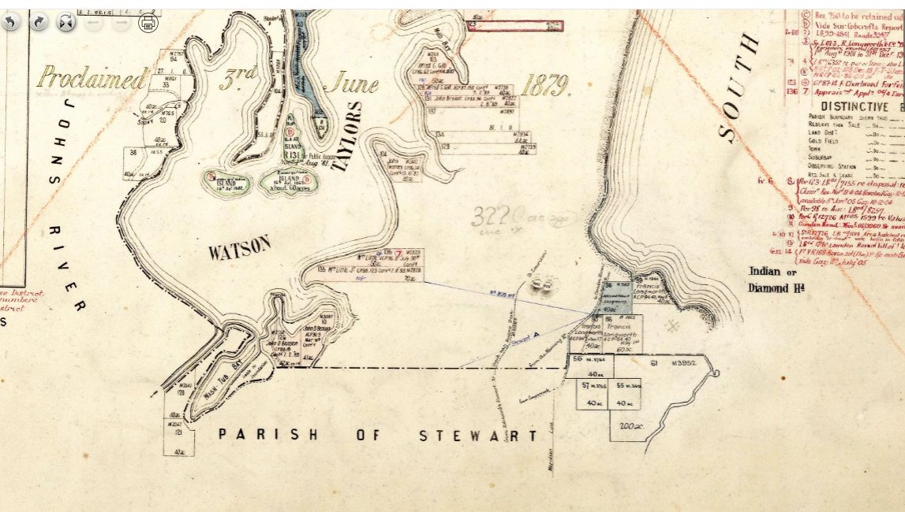
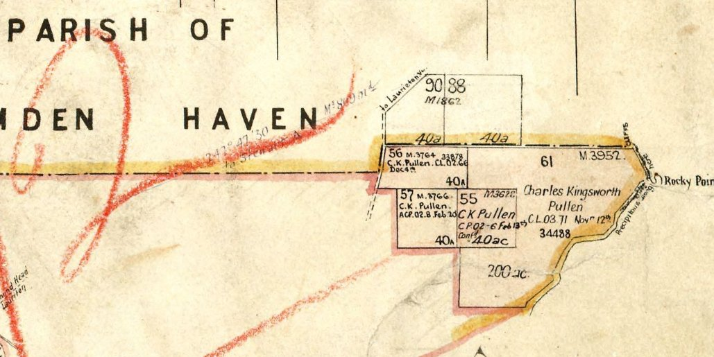
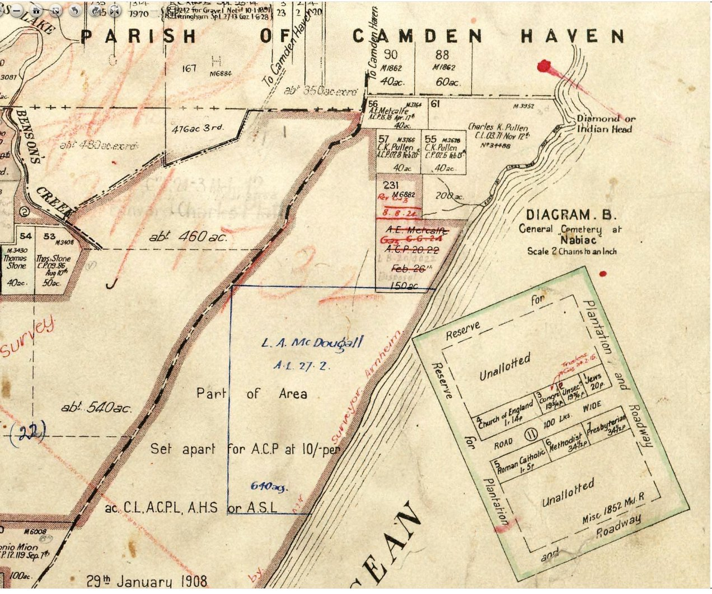
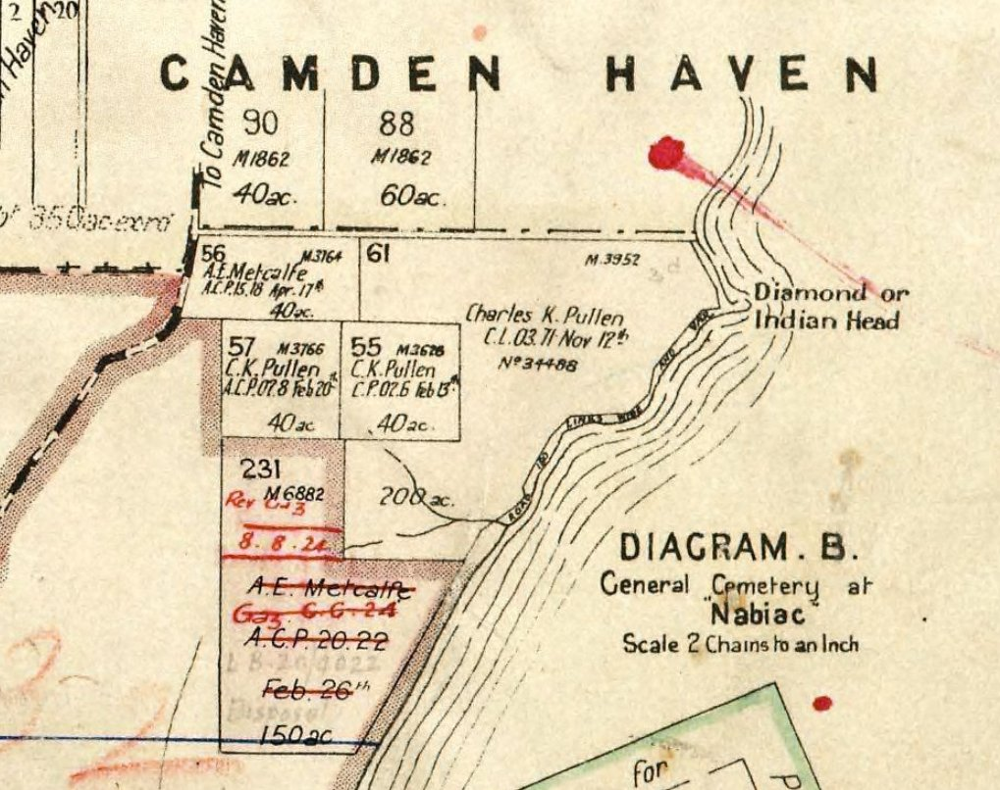
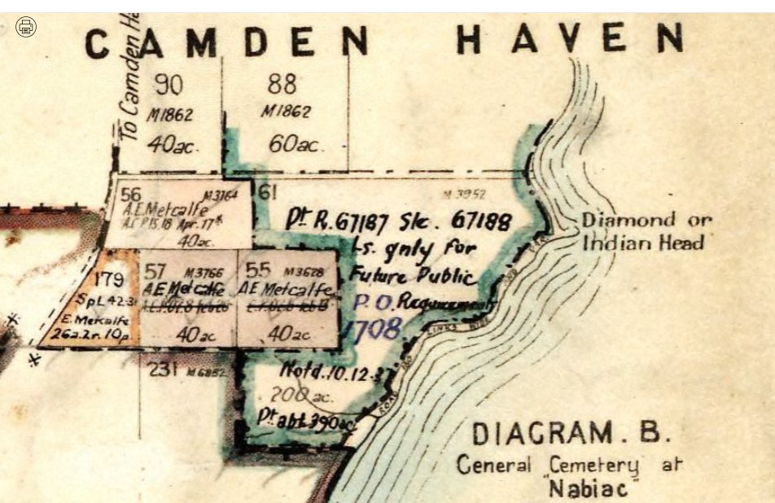
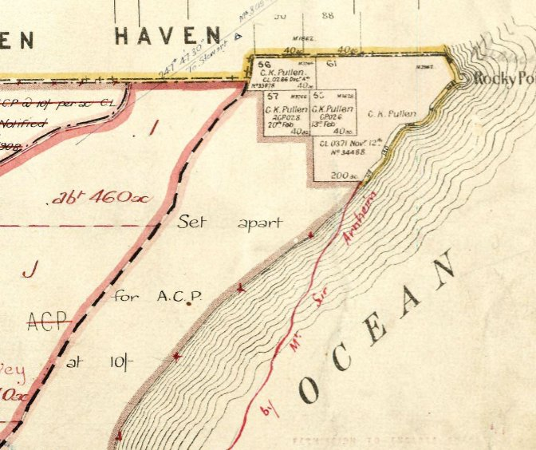
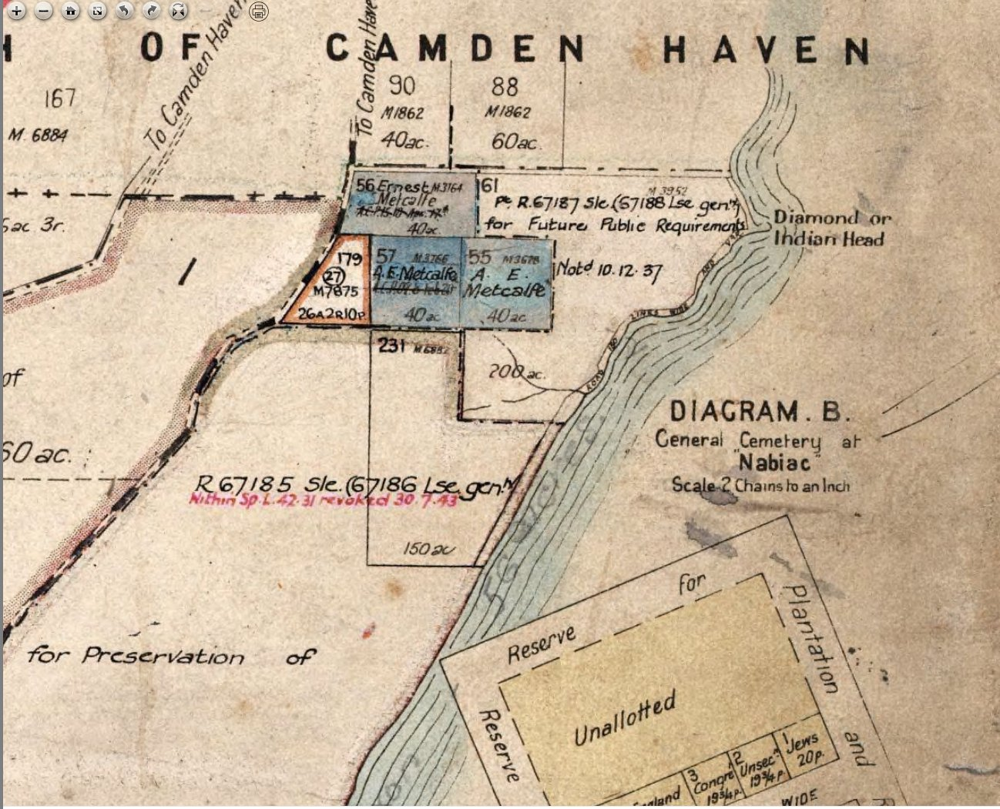
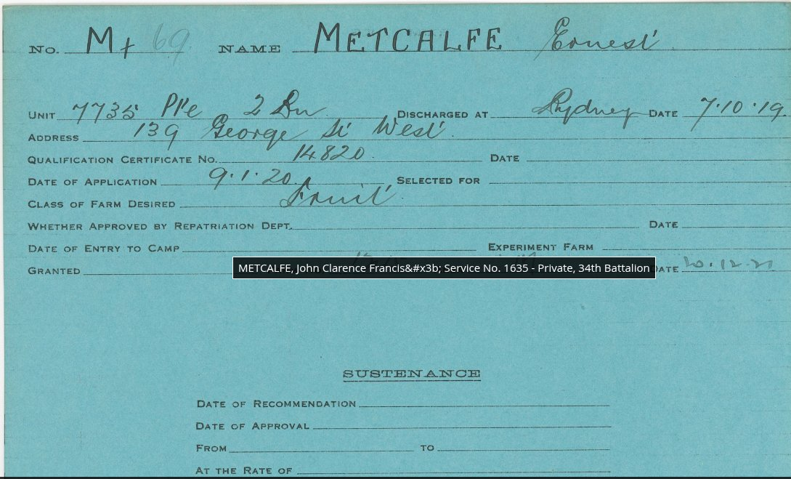

# Metcalfe Family at Diamond Head — Research Timeline & Sources

*Compiled from NSW Land Registry (HLRV), NSW State Archives, Trove, and primary documents*

---

## Family Connection

Ernest "Ernie" Metcalfe's family connects to the Gaudron family through **Janice Metcalfe**, who married **Bernard Gaudron** (son of Leo Vincent Gaudron). Both families farmed in the Camden Haven/Laurieton area — the Gaudrons on Portion 195 at Queens Lake, and the Metcalfes at Diamond Head, just 10km to the south. This proximity likely brought the two families together.

---

## The Metcalfe Family at Diamond Head

### Ernest "Ernie" A. Metcalfe — The Man on the Headland

Ernest Metcalfe was a WWI veteran, cattle farmer, and the real-life subject of Kylie Tennant's novel *The Man on the Headland* (1971). He lived as a recluse on approximately 300 acres of coastal land at Diamond Head, south of Laurieton, from the 1920s until the land was absorbed into Crowdy Bay National Park (reserved 1972). His name lives on through **Metcalfes Walking Track** in the park, and the reconstructed **Kylie's Hut** — a slab timber cottage Ernie built for Kylie Tennant as a writer's retreat.

### The Brothers

From Kylie Tennant's 1954 Sydney Morning Herald article "Portrait of a Gentleman," at least three Metcalfe brothers are identified:

- **Ernest (Ernie) A. Metcalfe** — WWI veteran (2nd Battalion, Service No. 7735). Never married. Lived at Diamond Head. Grazed cattle, kept bees, grew fruit. Described as "one of the greatest-hearted gentlemen" Tennant ever met.
- **Jack (possibly John Clarence Francis Metcalfe)** — "A real farmer" who worked the Diamond Head land before Ernie. Retired with a bad heart to live in a cedar caravan. Service No. 1635, 34th Battalion (if the soldier settlement cross-reference is correct).
- **Albert Metcalfe** — Lived near Laurieton by the lake. Kept 60 beehives which he sold to Ernie. Described as courteous with "beautiful manners" — "all the Metcalfes have beautiful manners."

### Possible Father

- **George Charles Metcalfe** — Appears on the Parish of Harrington map with a large holding (c.200 acres, CP 09.69) further south and inland from Diamond Head. Possibly the father of the Metcalfe brothers.

---

## Land Holdings — Parish of Stewart, County of Macquarie

The Metcalfe land at Diamond Head is in the **Parish of Stewart**, County of Macquarie, Land District of Taree, Manning Shire, Eastern Division NSW.

### Location

The holdings sit immediately west and south of **Diamond Head** (also called "Indian Head" on early maps), on the road to Camden Haven. The land is bounded by the South Pacific Ocean to the east, Watson Taylors Lake system to the north, and Crown forest land to the west and south. Kylie's Beach and the Diamond Head campground now occupy parts of this land within Crowdy Bay National Park.

### The Headland Question

Kylie Tennant described Ernie's land as "300 acres of swamp and cliff," and NPWS records state he "grazed cattle on Diamond Head." However, the formal land holdings shown on parish maps are slightly inland from the headland itself. The explanation is likely that:

- **Portion 61** (200+ acres between Ernie's portions and Diamond Head) was Crown land — first Pullen's Crown Lease, then reserved for "Future Public Requirements." Ernie almost certainly grazed cattle informally across this Crown land and the headland, as was common practice in remote coastal areas.
- The **"swamp"** Tennant describes — a lake full of lilies that Ernie drained with 12-foot ditches — would be the low-lying wetland between the inland portions and the coast.
- The headland itself was unallocated Crown land. When you're the only person living seven miles out on a dirt track, the boundary between your land and adjacent Crown land is largely academic.

### Confirmed Portions

**Portion 56 — 40 acres**
- Crown Plan M3164
- First acquired by **A.E. Metcalfe**, ACP 15.18, April 17th
- Later maps show **"Ernest Metcalfe"** — confirming A.E. and Ernest are the same person
- This was the first Metcalfe holding at Diamond Head

**Portion 57 — 40 acres**
- Crown Plan M3766
- Originally C.K. Pullen (ACP 07.8, Feb 20th)
- Later acquired by **A.E. Metcalfe**
- Shown as Metcalfe by 1932

**Portion 55 — 40 acres**
- Crown Plan M3628
- Originally C.K. Pullen (CP 02.6, Feb 13th)
- Later acquired by **A.E. Metcalfe**
- Noted 10.12.37

**Portion 179 — 26 acres 2 roods 10 perches**
- Crown Plan M7875
- Held by **E. Metcalfe** as Special Purpose Lease (SPL 42.3)

**Portion 231 — 150 acres**
- Crown Plan M6882
- Granted to **A.E. Metcalfe**, gazetted **6 June 1924**, ACP 20.22
- Carved from Crown land "set apart for ACP at 10/- per acre"
- **SPL revoked 30 July 1943** — land returned to Crown during WWII

**Total confirmed holdings: approximately 296 acres** (before Portion 231 revocation)

### Adjacent Portions

**Portion 61 — 200+ acres**
- Crown Plan M3952
- Originally **Charles K. Pullen**, Crown Lease CL 03.71, Nov 12th, No. 34488
- Later marked "for Future Public Requirements" (noted 10.12.37)
- Subsequently "Pt R.67187 Slc. 67188 Lse. Gen."
- Eventually absorbed into Crowdy Bay National Park

**Portions 88 and 90 — 60 acres and 40 acres**
- Crown Plan M1862
- On the road to Camden Haven, north of Metcalfe holdings

*Parish of Stewart showing the Diamond Head area with portions near Indian/Diamond Head*

*1912 edition — C.K. Pullen holds Portions 55, 56, 57 and 61. Note "Set apart for ACP at 10/- per acre" covering 460 acres*

*1920 edition — A.E. Metcalfe on Portion 56 and Portion 231 (gazetted 1924). Pullen still on Portions 55 and 57*

*Detail showing Pullen still holding Portions 55 and 57 while Metcalfe has acquired 56 and the new Portion 231*

*1932 edition — A.E. Metcalfe now holds Portions 55, 56, 57. E. Metcalfe on Portion 179*

*Later edition — Portion 56 now shows "Ernest Metcalfe," confirming A.E. and Ernest are the same person. Note Portion 61 "for Future Public Requirements" dated 1937*

*Detail showing the Crown reserving Portion 61 for future public purposes, and Portion 231 lease "revoked 30.7.43"*

---

## Chronological Timeline

### Pre-1912
**C.K. Pullen holds coastal portions.** Portions 55, 56, 57, and 61 near Diamond Head. Large areas of Crown land "set apart for ACP at 10/- per acre" (460+ acres).

### 1914–1918
**Ernest Metcalfe serves in WWI.** Service No. 7735, Private, **2nd Battalion** AIF. Discharged at Sydney **7 October 1919**.

**John Clarence Francis Metcalfe also serves.** Service No. 1635, Private, **34th Battalion**. Cross-referenced on Ernest's soldier settlement card — likely his brother Jack.

### 1918 (approx.)
**A.E. Metcalfe acquires Portion 56** (40 acres) — ACP 15.18, April 17th. The first Metcalfe foothold at Diamond Head. If "A.E." is Ernest, this would have been acquired just before or around his discharge.

### 9 January 1920
**Ernest applies for soldier settlement land.** Qualification Certificate No. 14820. Class of farm desired: **"Fruit."** Address: 139 George Street West.
*Source: NSW State Archives, NRS-14544-1-[6/14937]-[1036]*

*Ernest Metcalfe's Returned Soldier Settlement card — 2nd Battalion, QC 14820, fruit farm*

### 6 June 1924
**Portion 231 gazetted to A.E. Metcalfe.** 150 acres, ACP 20.22, carved from Crown land reserve. This may be the soldier settlement allocation linked to QC 14820.

### 1920s–1930s
**Metcalfe acquires Pullen's portions.** By 1932, A.E. Metcalfe holds Portions 55, 56, and 57 (120 acres total). E. Metcalfe holds Portion 179 (26 acres) as Special Purpose Lease.

### WWII era
**Kylie Tennant moves to Laurieton.** Meets Ernie through his brother Albert. Tennant writes: "Ernie had bought the 300 acres of swamp and cliff from his brother Jack who had retired, with a bad heart, to live in a caravan of cedar and painted glass, once the ornament of a circus."

### 30 July 1943
**Portion 231 Special Purpose Lease revoked.** 150 acres returned to Crown. Ernie loses a significant portion of his holdings.

### Late 1960s
**Ernie builds Kylie's Hut.** A timber slab cottage as a writer's retreat for Kylie Tennant, constructed single-handed from a hand-adzed barn. He also built a separate cottage for Kylie and her husband, selling them 1½ acres for £5 despite a valuer's estimate of £60.

### 1971
**"The Man on the Headland" published.** Kylie Tennant's novel inspired by Ernie Metcalfe and the Crowdy Bay landscape.

### 1972
**Crowdy Bay National Park reserved.** The Metcalfe land at Diamond Head is absorbed into the new national park.

### 1976
**Kylie Tennant donates hut and land.** The hut and surrounding land formally donated to the national park.

### 2019–2020
**Kylie's Hut destroyed in bushfires.** The original timber slab hut burnt during the 2019–20 bushfire season.

### 2022
**Kylie's Hut reconstructed.** Rebuilt by a local builder skilled in traditional woodwork techniques to preserve the historical connection.

---

## Ernie Metcalfe — From Kylie Tennant's Own Words

From "Portrait of a Gentleman," *Sydney Morning Herald*, 1 March 1954:

Ernie never married — he told Tennant that after the war, Australian girls seemed "uninteresting and stiff compared to French girls." He wore riding boots from his Queensland gold-digging days, a grey flannel undershirt, and corduroy trousers under an old army hat.

He drained a large lake full of lilies and wild ducks by digging ditches 12 feet deep — then lost interest and the ducks came back. He grew peaches, bananas, and strawberries but let the kangaroos, goats, and wallabies have them. His land was a wildlife sanctuary — koalas, possums, and shy birds. Shooters were met with Ernie's own rifle and a look that made them slink away.

He let swallows nest over his bed (covering himself with newspapers), surrendered his cane lounge to the fowls, and decided his bees "seem to need the honey more than I do." His favourite saying: "Whenever I feel the impulse to do anything, I lie down for half an hour and it wears off."

When he finally signed up for the old age pension, he told Tennant: "Now I am on the same level as royalty. The country's supporting both of us."

---

## Key Research Questions

1. **Ernest's middle name** — Does it start with "A"? This would confirm A.E. Metcalfe and Ernest Metcalfe are definitively the same person (already strongly indicated by the parish map showing "Ernest Metcalfe" on Portion 56 where "A.E. Metcalfe" had been). NSW BDM birth record would confirm.

2. **Jack's identity** — Is Jack the same as **John Clarence Francis Metcalfe** (Service No. 1635, 34th Battalion) cross-referenced on Ernie's soldier settlement card? If so, both brothers were returned soldiers.

3. **George Charles Metcalfe** — What is his relationship to the brothers? Father? His larger holding in the Parish of Harrington suggests an earlier generation.

4. **The transfer from Jack to Ernie** — When exactly did Ernie buy the land from Jack? Kylie Tennant says he "bought the 300 acres" but this doesn't appear in the Torrens Purchasers Index. The transfer may have been of a Crown lease rather than freehold, which wouldn't be recorded in Torrens.

5. **Soldier settlement file** — The full file linked to Qualification Certificate 14820 at State Archives would contain the complete land description and conditions. The record (NRS-14544) is marked "Cannot Be Issued" — may require special access or alternative viewing arrangements.

6. **Ernest's death date** — Not yet confirmed. He was on the old age pension by 1954 (age 65+), suggesting birth c.1889 or earlier.

7. **Connection between Gaudron and Metcalfe families** — How exactly did Bernard Gaudron (Leo's son) and Janice Metcalfe (Ernest's relative) meet? Both families farming in the Camden Haven area provides the geographic connection.

---

## Resources

- **HLRV (hlrv.nswlrs.com.au):** Parish maps of Stewart (County Macquarie) and Harrington
- **NSW State Archives (mhnsw.au):** Soldier Settlement files (NRS-14544); Crown Lands records; CP registers
- **National Archives of Australia (recordsearch.naa.gov.au):** Service records for Ernest Metcalfe (7735, 2nd Bn) and John Clarence Francis Metcalfe (1635, 34th Bn)
- **NSW BDM:** Birth records to confirm middle names and family relationships
- **Trove:** NSW Government Gazette for CP/ACP notifications; Sydney Morning Herald 1 March 1954 "Portrait of a Gentleman" by Kylie Tennant
- **Kylie Tennant, *The Man on the Headland* (1971)** — Novel inspired by Ernie Metcalfe
- **Crowdy Bay National Park / NPWS:** Historical information about Kylie's Hut, Metcalfes Walking Track, and the park's establishment
- **Port Macquarie-Hastings Council:** Historical rate records for the Diamond Head area

---

## Parish Map Reference

**Parish of Stewart, County of Macquarie**
- Land District of Taree
- Manning Shire
- Eastern Division, NSW
- HLRV reference for Edition 8 (1949): shown in attached PDF

**Relevant Crown Plan Numbers:**
- M3164 (Portion 56)
- M3766 (Portion 57)
- M3628 (Portion 55)
- M7875 (Portion 179)
- M6882 (Portion 231)
- M3952 (Portion 61)
- M1862 (Portions 88, 90)
